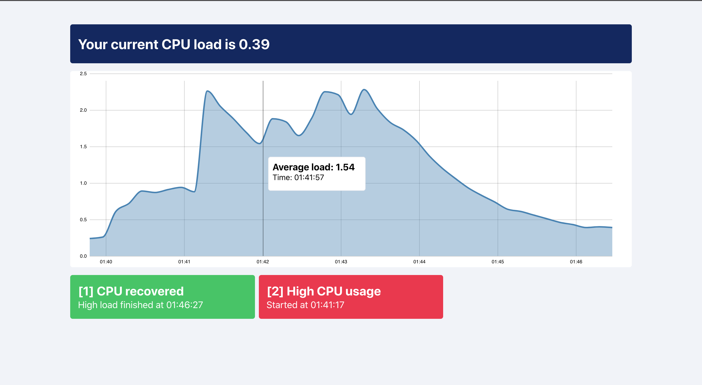

# Load Monitoring Web Application

Simple load monitoring application.
Frontend receives information about computer load every 10 seconds and keeps history up to 10 minutes. 

# How to run

There's 2 way you can run this project.

**Manually** 
1. Install dependencies in each folder separately \
  1.1 cd backend `npm install` \
  1.2 cd frontend `yarn install` 

2. Run each project separately \
   2.1  cd backend `npm start` \
   2.2. cd frontend `yarn start`

**Using Script**

1. At the root folder run `npm run setup`
2. After installation run `npm run start`

_Please note, if you are using script method, after you stop apps with cmd+c, backend process might still be running_

I used node version 14.2.0, but I guess 10.16.0 or any later version would work.

# Technologies

Frontend:
- React
- D3

Backend:
- Express
- Web Sockets (ws)

# Approach

## Backend
While working on this project I decided to let backend handle alerting logic and let frontend represent the incoming data. `LoadObserver` class is responsible for getting _cpu load, noticing high load/recoveries, keeping state if alert was sent and 2 minute window of high cpu usage_.

Since this app is proof of concept, my first assumption is it is going serve 1 client. This is why I initiate only 1 instance of `LoadObserver` on export.

When client connects to a websocket and is ready to recieve data, backend initiates setInterval and starts sending data from load observer every 10 seconds.

About alerts. I'm assuming that once cpu is under high load for 2 minutes or more, I need to send only 1 alert. So if CPU is under high load for 4/6/8 minutes, the end user will recieve only 1 alert (and not alert for every 2 minutes of high load). Because of this assumption I decided to omit calculations with time and went with simpler approach. Since appliation is real time, I can detect high load right away. For every tick, I check if load is higher than threshold, and if it's higer I store it in the window/queue/buffer(you name it) with size of 12 (number of 10 second intervals in 2 minutes). When window is full, I send user an alert about high cpu usage. When buffer overloads, I remove the oldest one and push new one. And if loads starts to go below threshold, with each tick, I start remove oldest tick in the queue. This way I know, if alert was sent and window became empty, cpu is recovered and I can send alert about recovery.

## Frontend 

I didn't want to overcomplicate frontend with state management libraries like redux/recoil/xstate and didn't want to oversimplify visualization with libraries like recharts. So that's why I'm keeping state with `useState` and later if I want to provide state deeper, I can use `context`.

The reason I didn't go for `styled-components` or other `css-in-js` libraries is because most of them work in the runtime and I didn't want to bring in more calculations to the system, considering we are already using d3.

The most important part - data visualization with d3. There are several ways to integrate d3 into react:

* Let react handle dom, and d3 math
* Let d3 as much control as possible
* And everything in between :)

I decided to go with the third option, by wrapping d3 functions in useEffect hook. Based on [Smashing Magazine's](https://www.smashingmagazine.com/2018/02/react-d3-ecosystem/) opinion, this method gives us a lightweight react component that can easily integrate with d3 api. Sounds like a win-win for me. The only drawback of this method is that server-side rendering is not possible (To be honest, I haven't tested this idea).

For visualizing cpu load, I decided to use `Line` and `Area` charts to show how cpu changed over time. Even though graph is already nice, I use to tooltip to show each datapoint at certain time.

# Further Improvements

  ## Frontend
  - Better D3 integration
  - 
  ## Backend
  - 