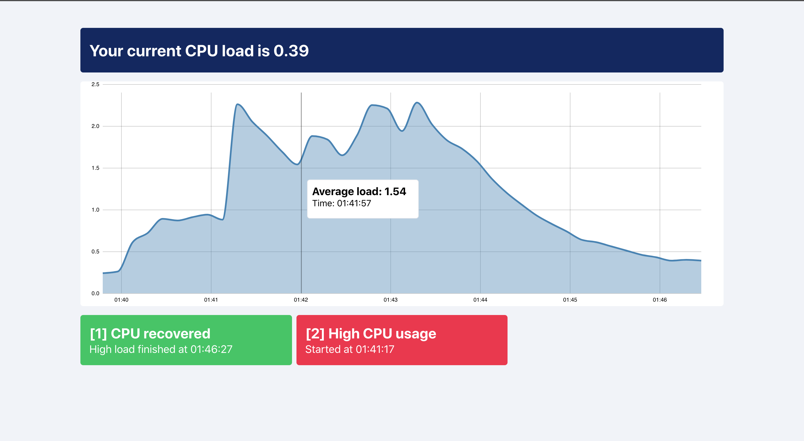

# Load Monitoring Web Application

Simple load monitoring application.
Frontend receives information about computer load every 10 seconds and keeps history up to 10 minutes. 

# How to run

There's 2 way you can run this project (I prefer first one)

**Manually** 
1. Install dependencies in each folder separately \
  1.1 cd backend `npm install` \
  1.2 cd frontend `yarn install` 

2. Run each project separately \
   2.1  cd backend `npm start` \
   2.2. cd frontend `yarn start`

**Using Script**

1. At the root folder run `npm run setup`
2. After installation run `npm run start`

_Please note, if you are using script method, after you stop apps with cmd+c, backend process might still be running_

I used node version 14.2.0, but I guess 10.16.0 or any later version would work.

# Testing CPU load

To test High CPU load you can run
`bash loadcpu.sh` command at the root folder and notice how average cpu load will increase

# Technologies

Frontend:
- React
- D3

Backend:
- Express
- Web Sockets (ws)

# Approach

## Backend
While working on this project I decided to let backend handle alerting logic and let frontend represent the incoming data. `LoadObserver` class is responsible for getting _cpu load, noticing high load, recoveries, keeping alert state and 2 minute window of high cpu usage_.

Since this app is a proof of concept, my first assumption was that the backend is going to serve 1 client. This is why I initiate only 1 instance of `LoadObserver` on export.

When the client connects to a websocket and is ready to receive data, the backend initiates setInterval and starts sending data from load observer every 10 seconds.

About alerts. I'm assuming that once cpu is under high load for 2 minutes or more, I need to send _only_ 1 alert. So if CPU is under high load continuously for 4/6/8 or more minutes, the end user will receive only 1 alert (and not alert for every 2 minutes of high load). Because of this assumption, I decided to omit calculations with time and went with a simpler approach. Since the application is real time, I can detect the high load right away. For every interval, I check if load is higher than the threshold, and if it is, I store it in the window/queue/buffer(you name it). The size of this window is 12 (number of 10 second intervals in 2 minutes). When the window is full, this means CPU was under high load for 2 minutes, so I send the user an alert about high cpu usage. When this window overloads, I remove the oldest one and push the new one. And if load starts to go below the threshold, with each interval, I start to remove the oldest object in the queue. This way I know, if the alert was sent and the window became empty, cpu is recovered and I can send an alert about recovery.

## Frontend 

I didn't want to overcomplicate frontend with state management libraries like redux/recoil/xstate and didn't want to oversimplify visualization with libraries like recharts. So that's why I'm handling state with `useState` and later if I would want to provide state deeper, I can use `context api`.

The reason I didn't go for `styled-components` or other `css-in-js` libraries is because most of them work in the runtime and I didn't want to bring in more calculations to the system, considering we are already using d3.

The most important part - data visualization with d3. There are several ways to integrate d3 into react:

* Let React handle the DOM, and d3 the math
* Let d3 have as much control as possible
* And everything in between :)

I decided to go with the third option, by wrapping d3 functions in useEffect hook. Based on [Smashing Magazine's](https://www.smashingmagazine.com/2018/02/react-d3-ecosystem/) opinion, this method gives us a lightweight react component that can easily integrate with d3 api. Sounds like a win-win for me. The only drawback of this method is that server-side rendering is not possible (To be honest, I haven't tested this idea).

For visualizing CPU load, I decided to use `Line` and `Area` charts to show how cpu changed over time. Even though the graph already shows how CPU load changed over time, I use to tooltip to show each datapoint at a certain time.

# Further Improvements

  ## Frontend
  - Better websocket integration. Right now app doesn't reconnect with backend after loosing a connection. I'd probably use a different approach, using graphql subscriptions. Underneath they also use websockets, and if I used Apollo client, I'd have a state management tool, ease of cache and and better api for the frontend.
  - Better D3 integration. Even though I'm happy with the approach I chose, I think it can be more performant. For example, in my current implementation I calculate tooltip on every hover. I probably can store all the calculated data, to reduce amount of recalculations.
  - Move from create-react-app, to a custom build. CRA is very opiniated and sometimes brings more troubles than simplicity. With own bundle build we can take control of how we serve frontend
  - Move from simple css, to something more complex like sass or css-in-js (that allows us precompile to just css to avoid loading during runtime)
  - I'd add chart alternative, table for example, for a11y purposes. Having graphs is nice, but for screen reader users, table would probably be a better alternative

  ## Backend
  - I'd improve the way I work with websockets. Right now server doesn't differentiate clients and just accepts any incoming connection/message. I'd even go for Apollo Server, so I could provide Graphql Subcriptions to the frontend.
  - I'd persist data and cache everything
  - I could also send alerts in different ways like email/push notification/sms etc.